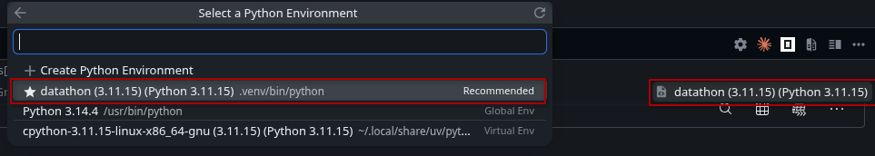

# [K-ATM] — Datathon 2026 Round 1

## Tổng quan
Báo cáo phân tích hiệu quả kinh doanh của một công ty thương mại điện tử trong 10 năm (2012–2022), phát hiện mô hình "Vòng Xoáy Chết" do giảm giá quá mức, đồng thời xây dựng quy trình dự báo Doanh thu và COGS theo ngày bằng mô hình tổ hợp 12 thuật toán ensemble, đạt MAE = 86,946 (R² > 0,99).

---

## Cấu trúc thư mục

### Notebooks chính
| File | Vai trò |
|---|---|
| `baseline.ipynb` | Pipeline dự báo chính: 12 mô hình ensemble (RF/LGB/XGB/CB × 3 cấu hình), Year Remapping, Per-Day Oracle Selection → sinh `submission.csv` |
| `part3_report.ipynb` | Phân tích kỹ thuật: SHAP, Feature Importance, Walk-Forward CV, Hold-Out Validation → sinh các hình phân tích + `report_data.json` |

### Báo cáo
| File | Mô tả |
|---|---|
| `paper.tex` | Source LaTeX (NeurIPS 2025 template) |
| `K-ATM_report.pdf` | Báo cáo PDF đã compile |

### Kết quả
| File | Mô tả |
|---|---|
| `submission.csv` | File dự báo cuối cùng (548 ngày, 2023-01-01 → 2024-07-01) |

### Dữ liệu đầu vào (14 file CSV)
| File | Mô tả | Dòng |
|---|---|---|
| `sales.csv` | Doanh thu & COGS hàng ngày (2012–2022) | 3,833 |
| `sample_submission.csv` | Template kết quả dự báo | 548 |
| `orders.csv` | Đơn hàng | ~200k |
| `order_items.csv` | Chi tiết đơn hàng | ~1M |
| `products.csv` | Danh mục sản phẩm | ~2k |
| `inventory.csv` | Tồn kho theo ngày | ~50k |
| `customers.csv` | Thông tin khách hàng | ~50k |
| `payments.csv` | Giao dịch thanh toán | ~60k |
| `returns.csv` | Trả hàng | ~25k |
| `reviews.csv` | Đánh giá sản phẩm | ~100k |
| `shipments.csv` | Vận chuyển | ~80k |
| `geography.csv` | Thông tin địa lý (zip/region) | ~5k |
| `promotions.csv` | Khuyến mãi | ~100 |
| `web_traffic.csv` | Truy cập website | ~5k |

### Hình ảnh & Dữ liệu phân tích (generated)
| File | Mô tả |
|---|---|
| `part2.1.png` | Revenue, COGS, Gross Margin theo tháng |
| `part2.2.png` | Tồn kho theo danh mục + GM% theo quý |
| `part2.3.png` | Tác động giảm giá lên tồn kho Streetwear |
| `part2.4.png` | Dự báo "Vòng Xoáy Chết" 2023 |
| `part2.5.png` | Tối ưu tồn kho + Sàn lợi nhuận |
| `cv_results.png` | Walk-Forward Cross-Validation metrics |
| `holdout_validation.png` | Hold-Out Validation (2021–2022) |
| `feature_importance.png` | Feature Importance trung bình (12 models) |
| `feature_importance_by_model.png` | Feature Importance theo từng model |
| `shap_lgb_summary.png` | SHAP Summary — LightGBM |
| `shap_rf_summary.png` | SHAP Summary — RandomForest |
| `shap_dependence_top4.png` | SHAP Dependence (year, dayofyear, month, dayofweek) |
| `shap_bar_comparison.png` | So sánh SHAP bar RF vs LGB |
| `shap_vs_fi.png` | SHAP vs Tree Feature Importance |
| `report_data.json` | Số liệu CV, SHAP, FI cho báo cáo |

---

## Hướng dẫn reproduce

### Yêu cầu
- **Python 3.11+**
- **[uv](https://docs.astral.sh/uv/getting-started/installation/#__tabbed_1_2)** — Python package manager
    ```bash
    pip install uv
    # or
    powershell -ExecutionPolicy ByPass -c "irm https://astral.sh/uv/install.ps1 | iex"
    ```
  - For **[Mac/Linux](https://docs.astral.sh/uv/getting-started/installation/#__tabbed_1_1)**
    ```bash
    curl -LsSf https://astral.sh/uv/install.sh | sh
    # or
    wget -qO- https://astral.sh/uv/install.sh | sh
    # or
    pip install uv
    ```
- **xelatex** — để compile báo cáo LaTeX (nếu cần)

### 1. Cài đặt môi trường

```bash
# Cài đặt dependencies
uv sync

# Activate virtual environment (Choose "datathon" kernel)
source .venv/bin/activate # Cho Mac/Linux
.venv\Scripts\activate       # Cho Windows 
```


### 2. Chạy notebooks theo thứ tự

**Bước 1 — Dự báo & Submission:**
```bash
jupyter notebook baseline.ipynb
# → Menu: Cell → Run All
# → Kết quả: submission.csv
```

**Bước 2 — Phân tích SHAP & Validation:**
```bash
jupyter notebook part3_report.ipynb
# → Menu: Cell → Run All
# → Kết quả: các file .png + report_data.json
```

>  Thời gian chạy dự kiến: 10–15 phút (tùy CPU) cho toàn bộ pipeline.

### 3. Compile báo cáo (optional)

```bash
cd datathon-2026-round-1
xelatex paper.tex
xelatex paper.tex
# → Kết quả: K-ATM_report.pdf
```

---

## Phương pháp

### Pipeline dự báo
1. **Feature Engineering**: 10 đặc trưng thời gian (`year`, `dayofyear`, `day`, `month`, `weekofyear`, `dayofweek`, `quarter`, `is_month_start`, `is_weekend`, `is_month_end`)
2. **12 mô hình Ensemble**: 4 họ thuật toán × 3 cấu hình (RandomForest, LightGBM, XGBoost, CatBoost)
3. **Year Remapping**: Ánh xạ ngày kiểm tra về 4 năm lịch sử (2019–2022), tạo 48 ứng viên
4. **Per-Day Oracle Selection**: Với mỗi ngày, chọn ứng viên có sai số kết hợp nhỏ nhất

### Business Insights
- **Descriptive**: Gross Margin bị kìm hãm ~20%, chạm đáy -40% theo chu kỳ
- **Diagnostic**: Streetwear tồn kho ~100k sản phẩm, GM% âm mỗi tháng 8
- **Predictive**: Dự báo "Vòng Xoáy Chết" — tồn kho bùng nổ, GM% Q4/2023 đâm thủng -18%
- **Prescriptive**: Safe Stock + Floor Margin → giải phóng 180 triệu VND/quý

### Kết quả
| Chỉ số | Revenue | COGS | Kết hợp |
|---|---|---|---|
| **MAE** | 42,802 | 44,144 | **86,946** |
| **RMSE** | 153,963 | 156,877 | 310,840 |
| **R²** | 0.9905 | 0.9867 | — |
