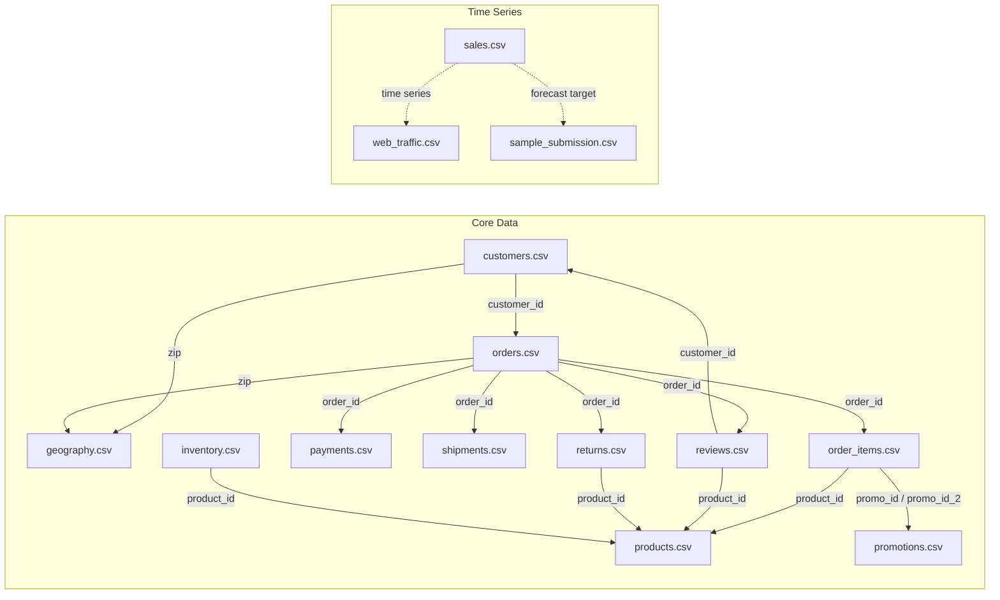

# Data Relationship Diagram

This diagram shows the main relationships between the CSV files in `test/datathon-2026-round-1`.

## Key relationships

- `customers.csv.customer_id` → `orders.csv.customer_id`
- `customers.csv.zip` → `geography.csv.zip`
- `orders.csv.zip` → `geography.csv.zip`
- `orders.csv.order_id` → `order_items.csv.order_id`, `payments.csv.order_id`, `shipments.csv.order_id`, `returns.csv.order_id`, `reviews.csv.order_id`
- `order_items.csv.product_id` → `products.csv.product_id`
- `order_items.csv.promo_id` / `promo_id_2` → `promotions.csv.promo_id`
- `reviews.csv.customer_id` → `customers.csv.customer_id`
- `reviews.csv.product_id` → `products.csv.product_id`
- `returns.csv.product_id` → `products.csv.product_id`
- `inventory.csv.product_id` → `products.csv.product_id`

## Notes

- `sales.csv` và `web_traffic.csv` là dữ liệu thời gian, không có khóa ngoại trực tiếp tới các bảng đơn hàng.
- `sample_submission.csv` trong cùng thư mục có cấu trúc giống `sales.csv` và dường như là mẫu nộp dự báo.
- Các tệp `data/europe.csv` và `data/sample_submission.csv` nằm ngoài nhóm `datathon-2026-round-1` và không liên quan trực tiếp đến mối quan hệ này.

## How to view
- Open this file in VS Code
- Use Markdown preview (`Ctrl+Shift+V`)
- If needed, install `Markdown Preview Mermaid Support` extension