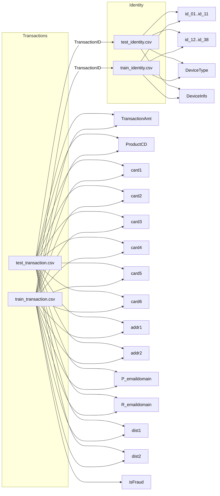

# Data Relationship Diagram

This diagram shows the main links between the CSV files in the `datathon` dataset.

## How to view
- Open this file in VS Code
- Use Markdown preview (`Ctrl+Shift+V`)
- If needed, install `Markdown Preview Mermaid Support` extension